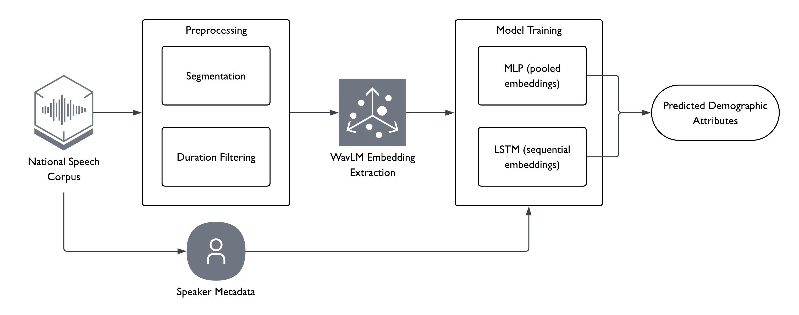

# Modelling Demographic Variation in Singapore English Speech

A Final Year Project (FYP) on demographic prediction in Singapore English (SgE) using self-supervised speech representations. This repository explores whether speaker embeddings derived from WavLM retain information about demographic attributes such as gender, ethnicity, and age.

## Project Overview

The project uses `WavLM Base+` representations and prediction heads to study how demographic variation is reflected in Singapore English speech. The current experiments focus on three supervised tasks:

- `gender` classification
- `ethnicity` classification
- `age` classification/regression

Two downstream model families are implemented:

- MLP on pooled utterance-level embeddings
- LSTM on sequential frame-level embeddings (150 random utterances per speaker)

## Pipeline



Workflow:
1. Prepare metadata and speaker-disjoint train/val/test splits.
2. Extract embeddings from speech audio using a pretrained WavLM model.
3. Train downstream MLP and LSTM models for demographic prediction.
4. Evaluate held-out test performance and subgroup behaviour.

## Results Overview

Saved evaluation outputs are available under `results/evaluation/part1/`, `results/evaluation/part2/`, and `results/evaluation/part3/`.

### Gender and Ethnicity Classification

| Part | Task | MLP Accuracy | MLP Macro-F1 | LSTM Accuracy | LSTM Macro-F1 |
| --- | --- | ---: | ---: | ---: | ---: |
| 1 | Gender | 0.9787 | 0.9784 | 0.9788 | 0.9786 |
| 1 | Ethnicity | 0.7531 | 0.6807 | 0.8257 | 0.7764 |
| 2 | Gender | 0.9910 | 0.9910 | 0.9910 | 0.9910 |
| 2 | Ethnicity | 0.6680 | 0.5640 | 0.8140 | 0.7490 |
| 3 | Gender | 0.9860 | 0.9860 | 0.9850 | 0.9850 |
| 3 | Ethnicity | 0.6960 | 0.6050 | 0.8130 | 0.7220 |

### Age Tasks

- Parts 1 and 2 use age regression (`age_raw`)
    - Evaluation metric: mean absolute error (MAE).
- Part 3 uses age classification (`age_bin`)
    - Evaluation metric: accuracy / macro-F1.

| Part | Target | MLP | LSTM |
| --- | --- | ---: | ---: |
| 1 | `age_raw` (MAE) | 6.8286 | 6.5503 |
| 2 | `age_raw` (MAE) | 7.07 | 6.25 |
| 3 | `age_bin` (Acc / Macro-F1) | 0.3650 / 0.3460 | 0.4200 / 0.3890 |

### Model Checkpoints

Checkpoints for all three parts are included in this repository:

- Part 1: `results/mlp/part1_mlp_full/` (MLP), `results/lstm/part1_cap150/` (LSTM)
- Part 2: `results/mlp/part2_mlp_full/` (MLP), `results/lstm/part2_cap150/` (LSTM)
- Part 3: `results/mlp/part3_mlp_full/` (MLP), `results/lstm/part3_cap150/` (LSTM)

Each directory contains one checkpoint per task (`gender`, `ethnicity`, `age_raw` or `age_bin`).

## Inference

Run demographic prediction on any WAV file using a saved checkpoint:

```bash
python -m scripts.inference \
    --checkpoint results/mlp/part1_mlp_full/gender/best_mlp_gender.pt \
    --audio /path/to/speaker.wav
```

## Repository Structure

- `scripts/`: preprocessing, feature extraction, training, and evaluation code
- `hpc/`: PBS job scripts for running pipeline stages on a HPC cluster
- `data/`: metadata and split definitions
- `docs/`: supplementary workflow notes and usage guides
- `figures/`: diagrams and report figures
- `results/`: saved checkpoints, evaluation metrics, and plots

Additional documentation:

- `docs/PIPELINE.md`: step-by-step commands for reproducing the full pipeline
- `docs/UTTERANCE_TABLE_GUIDE.md`: guide for building per-part utterance tables, including Part 3 TextGrid slicing
- `docs/DATASET_ADAPTATION_GUIDE.md`: how to adapt the pipeline to a new dataset
