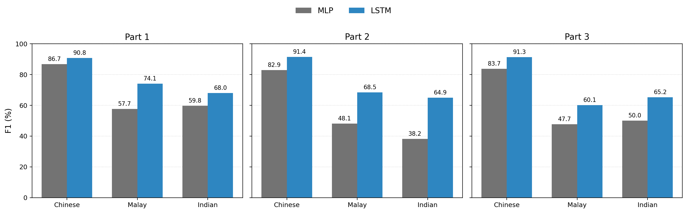
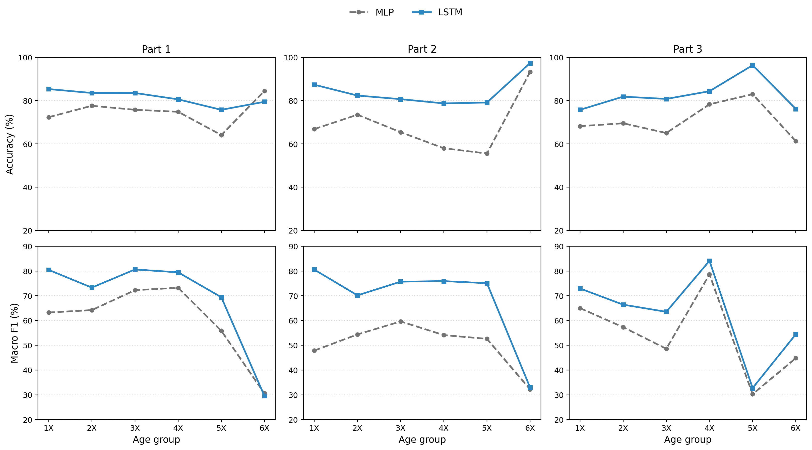

# Modelling Demographic Variation in Singapore English Speech

This Final Year Project investigates whether self-supervised speech representations encode demographic information in Singapore English speech. The pipeline extracts `WavLM Base+` frame-level representations and trains lightweight downstream models for speaker profiling.

The main experiments evaluate:

- `gender` classification
- `ethnicity` classification
- `age_raw` regression

Two model families are compared:

- MLP over pooled utterance-level embeddings
- LSTM over frame-level embedding sequences

## Pipeline

Workflow:

1. Clean speaker metadata and create speaker-disjoint train/validation/test splits.
2. Build utterance tables from the speech corpus.
3. Extract WavLM embeddings for each utterance.
4. Train MLP and LSTM demographic prediction heads.
5. Evaluate held-out performance and class-level/subgroup behaviour.

## Results

Saved summary metrics are included under `results/evaluation/`.

### Gender and Ethnicity

| Part | Task | MLP Accuracy | MLP Macro-F1 | LSTM Accuracy | LSTM Macro-F1 |
| --- | --- | ---: | ---: | ---: | ---: |
| 1 | Gender | 0.9787 | 0.9784 | 0.9788 | 0.9786 |
| 1 | Ethnicity | 0.7531 | 0.6807 | 0.8257 | 0.7764 |
| 2 | Gender | 0.9910 | 0.9910 | 0.9910 | 0.9910 |
| 2 | Ethnicity | 0.6680 | 0.5640 | 0.8140 | 0.7490 |
| 3 | Gender | 0.9860 | 0.9860 | 0.9850 | 0.9850 |
| 3 | Ethnicity | 0.6960 | 0.6050 | 0.8130 | 0.7220 |

Ethnicity prediction improves consistently with the sequence-based LSTM, especially for minority ethnic groups.

Age-group subgroup metrics show how ethnicity performance varies across speaker age bands.

### Age Regression

Parts 1 and 2 evaluate age as a continuous regression target using mean absolute error (MAE).

| Part | Target | MLP MAE | LSTM MAE |
| --- | --- | ---: | ---: |
| 1 | `age_raw` | 6.8286 | 6.5503 |
| 2 | `age_raw` | 7.0700 | 6.2500 |

## Repository Structure

- `scripts/`: preprocessing, feature extraction, model training, evaluation, analysis, and figure generation
- `docs/`: pipeline and utterance-table guides
- `data/`: lightweight metadata summaries and split definitions
- `figures/`: README and report figures
- `results/evaluation/`: saved summary metrics and confusion-matrix plots
- `requirements.txt`: Python package requirements

Additional documentation:

- `docs/PIPELINE.md`: end-to-end commands for reproducing the experiments
- `docs/UTTERANCE_TABLE_GUIDE.md`: utterance-table construction details
